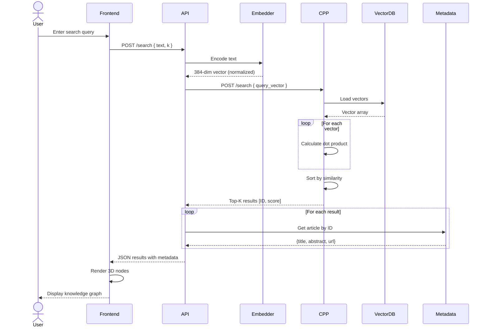
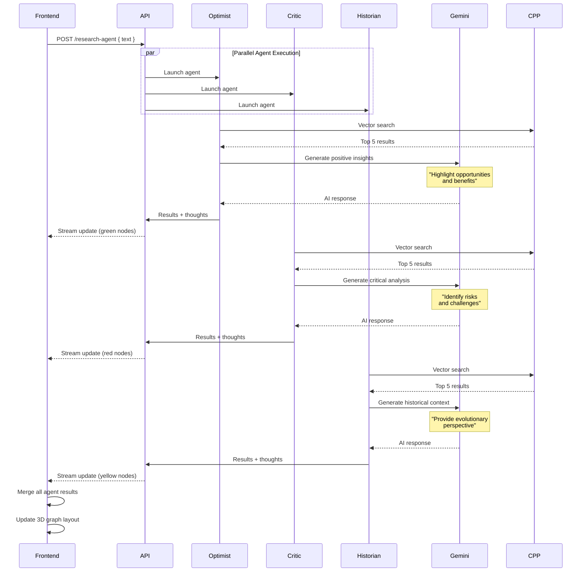
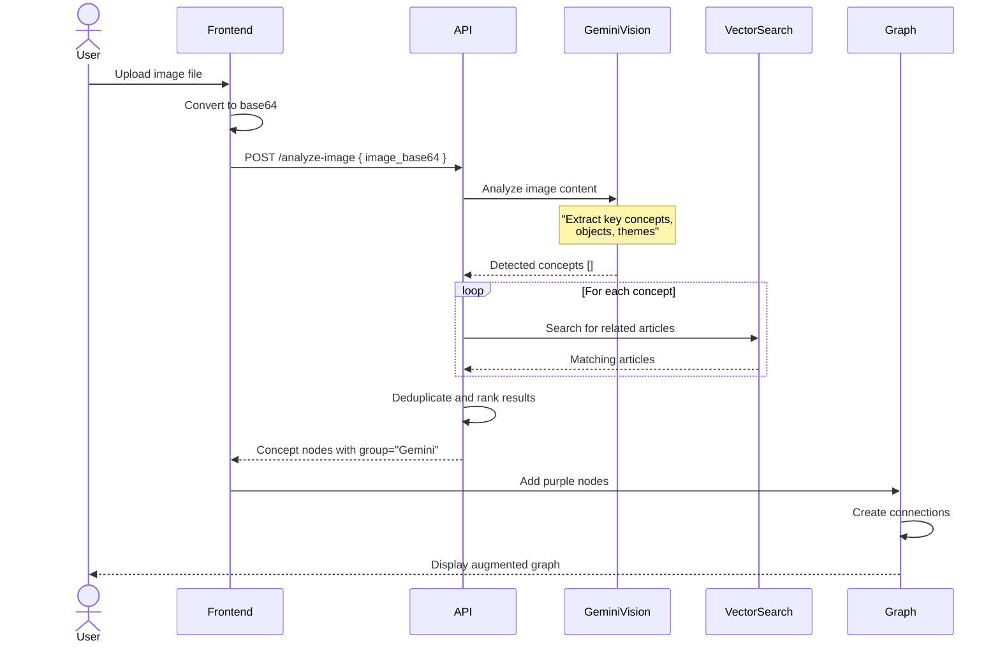
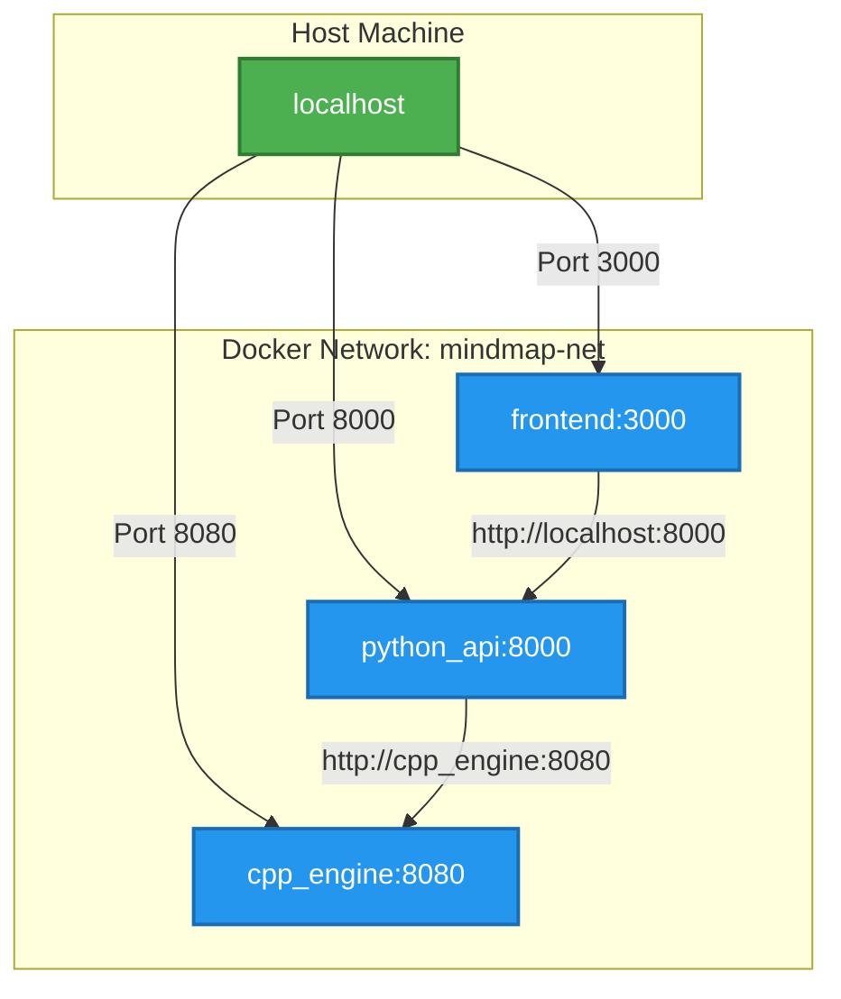
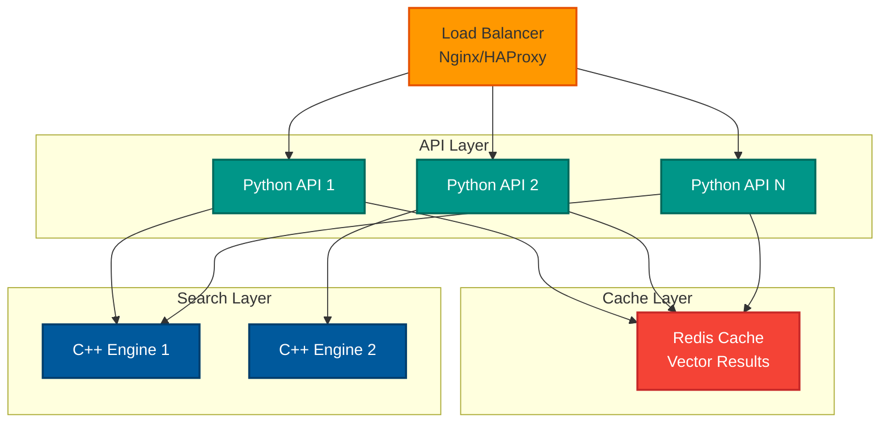

# MindMapAI Architecture Documentation

## System Architecture Diagram

```mermaid
flowchart TB
    subgraph "Client Layer"
        USER["👤 User Browser"]
    end

    subgraph "Frontend - Next.js Application"
        NEXT["Next.js Server<br/>Port 3000"]
        
        subgraph "React Components"
            PAGE["page.tsx<br/>Home Route"]
            GRAPH["Graph.js<br/>3D Visualization"]
            UI["UI Components<br/>Search, Terminal"]
        end
        
        subgraph "Three.js Rendering"
            FORCE["ForceGraph3D<br/>Physics Engine"]
            THREE["Three.js<br/>WebGL Renderer"]
            SPRITE["SpriteText<br/>Labels"]
        end
        
        NEXT --> PAGE
        PAGE --> GRAPH
        GRAPH --> UI
        GRAPH --> FORCE
        FORCE --> THREE
        FORCE --> SPRITE
    end

    subgraph "API Layer - FastAPI Backend"
        API["FastAPI Application<br/>Port 8000"]
        
        subgraph "Endpoints"
            EP1["/search<br/>Basic Search"]
            EP2["/research-agent<br/>Multi-Agent"]
            EP3["/analyze-image<br/>Vision AI"]
        end
        
        subgraph "Core Logic"
            EMBED["Embedding Generator<br/>SentenceTransformer"]
            ENRICH["Data Enrichment<br/>Metadata Hydration"]
            WIKI["Wikipedia API<br/>Thumbnail Fetcher"]
        end
        
        API --> EP1
        API --> EP2
        API --> EP3
        EP1 --> EMBED
        EP2 --> EMBED
        EP3 --> EMBED
        EMBED --> ENRICH
        ENRICH --> WIKI
    end

    subgraph "AI Processing Layer"
        subgraph "Google AI"
            GEMINI["Gemini 2.0 Flash<br/>Text Generation"]
            VISION["Gemini Vision<br/>Image Analysis"]
        end
        
        subgraph "Agent System"
            direction TB
            A1["🟢 Optimist Agent<br/>Opportunities & Benefits"]
            A2["🔴 Critic Agent<br/>Risks & Challenges"]
            A3["🟡 Historian Agent<br/>Historical Context"]
        end
        
        subgraph "Embedding Model"
            ST["Sentence Transformers<br/>all-MiniLM-L6-v2<br/>384 dimensions"]
        end
    end

    subgraph "Vector Engine - C++ Server"
        CPP["C++ HTTP Server<br/>Port 8080"]
        
        subgraph "Search Algorithm"
            direction TB
            LOAD["Vector Loader<br/>Binary Reader"]
            DOT["Dot Product<br/>Calculator"]
            SORT["Result Sorter<br/>Top-K Selection"]
            LOAD --> DOT
            DOT --> SORT
        end
        
        subgraph "Libraries"
            HTTPLIB["cpp-httplib<br/>HTTP Server"]
            JSON["nlohmann/json<br/>JSON Parser"]
        end
        
        CPP --> LOAD
        CPP --> HTTPLIB
        CPP --> JSON
    end

    subgraph "Data Storage Layer"
        subgraph "Persistent Storage"
            VECTORS["vectors.bin<br/>Binary Embeddings<br/>2000×384 float32"]
            META["data.json<br/>Wikipedia Metadata<br/>Titles, Abstracts, URLs"]
        end
        
        subgraph "External Data"
            WIKIPEDIA["Wikipedia API<br/>en.wikipedia.org"]
            DATASET["HuggingFace Dataset<br/>wikipedia/20231101.en"]
        end
    end

    subgraph "Data Pipeline"
        direction LR
        FETCH["get_wiki_data.py<br/>Article Fetcher"]
        CREATE["create_embeddings.py<br/>Vector Generator"]
        FETCH --> META
        META --> CREATE
        CREATE --> VECTORS
    end

    subgraph "Infrastructure"
        subgraph "Container Orchestration"
            COMPOSE["Docker Compose<br/>Multi-Service Manager"]
            NET["Docker Network<br/>mindmap-net"]
        end
        
        subgraph "Containers"
            DC1["frontend<br/>Container"]
            DC2["python_api<br/>Container"]
            DC3["cpp_engine<br/>Container"]
        end
        
        subgraph "Configuration"
            ENV[".env Files<br/>API Keys"]
            DFILE["Dockerfiles<br/>Build Configs"]
        end
        
        COMPOSE --> NET
        NET --> DC1
        NET --> DC2
        NET --> DC3
        ENV -.-> DC2
        DFILE -.-> COMPOSE
    end

    %% User Interactions
    USER -->|"HTTP GET /"| NEXT
    USER -->|"Search Query"| GRAPH
    USER -->|"Upload Image"| GRAPH

    %% Frontend to Backend
    GRAPH -->|"POST /search"| EP1
    GRAPH -->|"POST /research-agent"| EP2
    GRAPH -->|"POST /analyze-image"| EP3

    %% Backend to AI
    EP2 -->|"Generate Insights"| A1
    EP2 -->|"Generate Insights"| A2
    EP2 -->|"Generate Insights"| A3
    A1 -->|"Text Prompt"| GEMINI
    A2 -->|"Text Prompt"| GEMINI
    A3 -->|"Text Prompt"| GEMINI
    EP3 -->|"Image Data"| VISION
    EMBED -->|"Text Input"| ST

    %% Backend to Vector Engine
    EMBED -->|"POST /search<br/>Query Vector"| CPP
    A1 -->|"POST /search"| CPP
    A2 -->|"POST /search"| CPP
    A3 -->|"POST /search"| CPP
    CPP -->|"Result IDs + Scores"| ENRICH

    %% Data Access
    ENRICH -->|"Lookup by ID"| META
    WIKI -->|"Fetch Thumbnail"| WIKIPEDIA
    CPP -->|"Load on Startup"| VECTORS

    %% Data Pipeline
    FETCH -->|"Stream Download"| DATASET

    %% Infrastructure
    DC1 -.->|"Contains"| NEXT
    DC2 -.->|"Contains"| API
    DC3 -.->|"Contains"| CPP

    %% Styling
    classDef frontend fill:#61dafb,stroke:#21759b,stroke-width:3px,color:#000
    classDef backend fill:#009688,stroke:#00695c,stroke-width:3px,color:#fff
    classDef ai fill:#bf00ff,stroke:#7b00a0,stroke-width:3px,color:#fff
    classDef engine fill:#00599C,stroke:#003d6b,stroke-width:3px,color:#fff
    classDef data fill:#ffcc00,stroke:#cc9900,stroke-width:3px,color:#000
    classDef infra fill:#2496ED,stroke:#1a6db3,stroke-width:3px,color:#fff
    classDef user fill:#4caf50,stroke:#2e7d32,stroke-width:3px,color:#fff

    class USER user
    class NEXT,PAGE,GRAPH,UI,FORCE,THREE,SPRITE,DC1 frontend
    class API,EP1,EP2,EP3,EMBED,ENRICH,WIKI,DC2 backend
    class GEMINI,VISION,A1,A2,A3,ST ai
    class CPP,LOAD,DOT,SORT,HTTPLIB,JSON,DC3 engine
    class VECTORS,META,WIKIPEDIA,DATASET,FETCH,CREATE data
    class COMPOSE,NET,ENV,DFILE infra
```



---

## Data Flow Diagrams

### 1. Search Request Flow



### 2. Multi-Agent Research Flow



### 3. Image Analysis Flow



---

## Component Responsibilities

### Frontend (`/frontend`)

| Component | Responsibility |
|-----------|----------------|
| **page.tsx** | Main route, renders SearchGraph component |
| **Graph.js** | Orchestrates 3D visualization, manages state |
| **ForceGraph3D** | Physics simulation, node positioning |
| **Three.js** | WebGL rendering, materials, lighting |
| **UI Components** | Search input, terminal view, instructions |

**Key Features:**
- Client-side rendering with `'use client'` directive
- Dynamic imports for SSR compatibility
- Real-time graph updates via state management
- Material caching for performance optimization

---

### Python API (`/python-api`)

| Module | Responsibility |
|--------|----------------|
| **api.py** | FastAPI app, endpoint definitions, business logic |
| **create_embeddings.py** | Batch vector generation from data.json |
| **get_wiki_data.py** | Wikipedia article download and preprocessing |
| **test_server.py** | API integration tests |

**Key Features:**
- Async endpoints with FastAPI
- CORS middleware for cross-origin requests
- Environment-based configuration
- Lifecycle management (startup/shutdown)

**Dependencies:**
```python
fastapi>=0.100.0
sentence-transformers>=2.0.0
google-generativeai>=0.3.0
numpy>=1.24.0
wikipedia>=1.4.0
python-dotenv>=1.0.0
uvicorn>=0.23.0
```

---

### C++ Engine (`/cpp-engine`)

| File | Responsibility |
|------|----------------|
| **server.cpp** | HTTP server, request handling, response formatting |
| **engine.cpp** | Standalone test program for vector operations |
| **httplib.h** | Single-header HTTP server library |
| **json.hpp** | JSON serialization/deserialization |

**Key Features:**
- Zero-copy vector operations
- Binary file format for fast loading
- O(n) brute-force search (acceptable for 2000 vectors)
- Thread-safe request handling

**Compilation:**
```bash
g++ -std=c++17 -O3 -pthread -o server server.cpp
```

---

## Binary File Format (`vectors.bin`)

```
Offset | Type    | Description
-------|---------|----------------------------------
0x00   | int32   | Number of vectors (e.g., 2000)
0x04   | int32   | Vector dimensions (384)
0x08   | float32 | Vector[0][0]
0x0C   | float32 | Vector[0][1]
...    | ...     | ...
```

**Size Calculation:**
- Header: 8 bytes (2 × int32)
- Data: `num_vectors × vector_dim × 4 bytes`
- Example: 2000 × 384 × 4 + 8 = **3,072,008 bytes (~3 MB)**

---

## Network Architecture



**Port Mapping:**
- All services expose ports to host via `docker-compose.yml`
- Internal communication uses Docker DNS (service names)
- Frontend uses `localhost` for API calls (accessed from browser)

---

## Security Considerations

### Current Implementation
- ⚠️ CORS allows all origins (`allow_origins=["*"]`)
- ⚠️ No authentication on API endpoints
- ⚠️ API keys in environment variables (not encrypted)
- ✅ No SQL database (no injection vulnerabilities)
- ✅ Base64 encoding for image uploads

### Production Recommendations
1. **Restrict CORS**: Whitelist specific domains
2. **Add Authentication**: Implement JWT tokens or OAuth
3. **Rate Limiting**: Prevent abuse of expensive AI operations
4. **API Key Rotation**: Regular key updates
5. **Input Validation**: Sanitize user queries
6. **HTTPS**: Use TLS for all communications
7. **Secrets Management**: Use Docker secrets or Vault

---

## Scalability Strategies

### Horizontal Scaling



### Optimization Opportunities

| Component | Current | Optimization |
|-----------|---------|--------------|
| **Vector Search** | Brute-force O(n) | HNSW index (O(log n)) |
| **Embeddings** | CPU | GPU acceleration |
| **API Calls** | Serial | Connection pooling |
| **Frontend** | Client-side | Server-side rendering |
| **Caching** | None | Redis for search results |

---

## Technology Alternatives

### Vector Database Options
| Technology | Pros | Cons |
|------------|------|------|
| **Current (Custom C++)** | Simple, fast for small datasets | Doesn't scale beyond 10k vectors |
| **Faiss** | Fast, battle-tested | Requires Python bindings |
| **Milvus** | Production-ready, distributed | Heavy infrastructure |
| **Pinecone** | Managed service | Cost, vendor lock-in |
| **Weaviate** | GraphQL API, open-source | Learning curve |

### Embedding Model Options
| Model | Dimensions | Performance | Use Case |
|-------|------------|-------------|----------|
| **all-MiniLM-L6-v2** | 384 | Fast, 120MB | Current (general) |
| **all-mpnet-base-v2** | 768 | Medium, 420MB | Higher accuracy |
| **e5-large-v2** | 1024 | Slow, 1.3GB | Best quality |
| **OpenAI Ada-002** | 1536 | API call | Multilingual |

### Frontend Frameworks
| Framework | Pros | Cons |
|-----------|------|------|
| **Next.js (Current)** | SSR, React ecosystem | Complex |
| **SvelteKit** | Smaller bundle | Less mature |
| **Astro** | Static-first | Limited interactivity |
| **Plain React** | Simplest | No SSR |

---

## Development Roadmap

### Phase 1: Core Functionality ✅
- [x] Wikipedia data ingestion
- [x] Vector embedding generation
- [x] C++ search engine
- [x] FastAPI backend
- [x] 3D graph visualization
- [x] Multi-agent system

### Phase 2: Enhancements (Current)
- [ ] User authentication
- [ ] Saved graph sessions
- [ ] Export functionality (PNG, JSON)
- [ ] Mobile responsive design
- [ ] Performance monitoring

### Phase 3: Scale & Polish
- [ ] Production deployment (AWS/GCP/Azure)
- [ ] Horizontal scaling
- [ ] Vector database migration (Faiss/Milvus)
- [ ] Advanced graph algorithms
- [ ] Collaborative features

### Phase 4: Advanced Features
- [ ] Custom data sources
- [ ] Natural language queries
- [ ] Graph analytics dashboard
- [ ] API for third-party integration
- [ ] Plugin system

---

## Monitoring & Observability

### Recommended Tools
- **Application**: Prometheus + Grafana
- **Logs**: ELK Stack (Elasticsearch, Logstash, Kibana)
- **Tracing**: OpenTelemetry + Jaeger
- **Errors**: Sentry
- **Uptime**: UptimeRobot

### Key Metrics to Track
- API response times (p50, p95, p99)
- Vector search latency
- Gemini API quota usage
- Frontend rendering performance
- Error rates by endpoint
- Cache hit rates

---

## Deployment Checklist

- [ ] Set production environment variables
- [ ] Restrict CORS origins
- [ ] Enable HTTPS/TLS
- [ ] Set up monitoring and logging
- [ ] Configure backup for vectors.bin
- [ ] Implement rate limiting
- [ ] Add health check endpoints
- [ ] Enable container restart policies
- [ ] Set resource limits (CPU/memory)
- [ ] Configure log rotation
- [ ] Enable security headers
- [ ] Test disaster recovery

---

## References

- [FastAPI Documentation](https://fastapi.tiangolo.com/)
- [Next.js Documentation](https://nextjs.org/docs)
- [Three.js Documentation](https://threejs.org/docs/)
- [Sentence Transformers](https://www.sbert.net/)
- [Gemini API Guide](https://ai.google.dev/docs)
- [cpp-httplib GitHub](https://github.com/yhirose/cpp-httplib)
- [Docker Compose Reference](https://docs.docker.com/compose/)

---

<p align="center">
  <em>Last Updated: February 2026</em>
</p>
