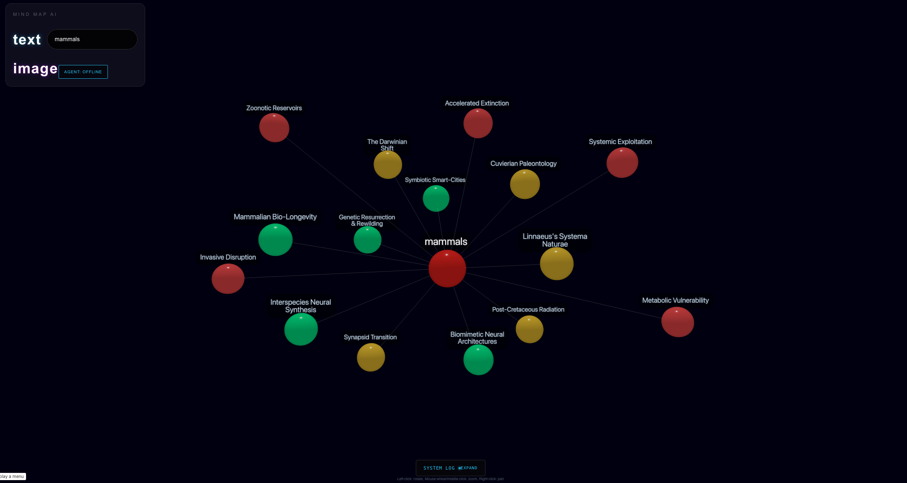
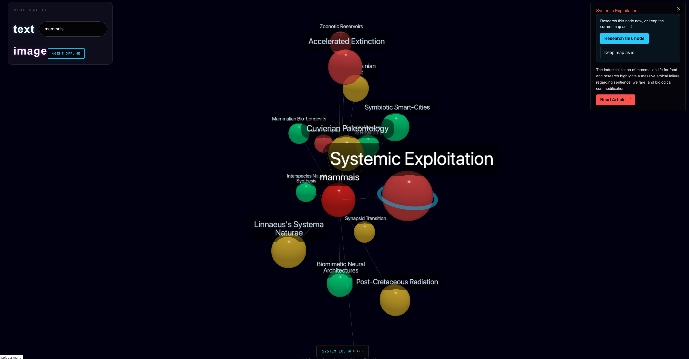
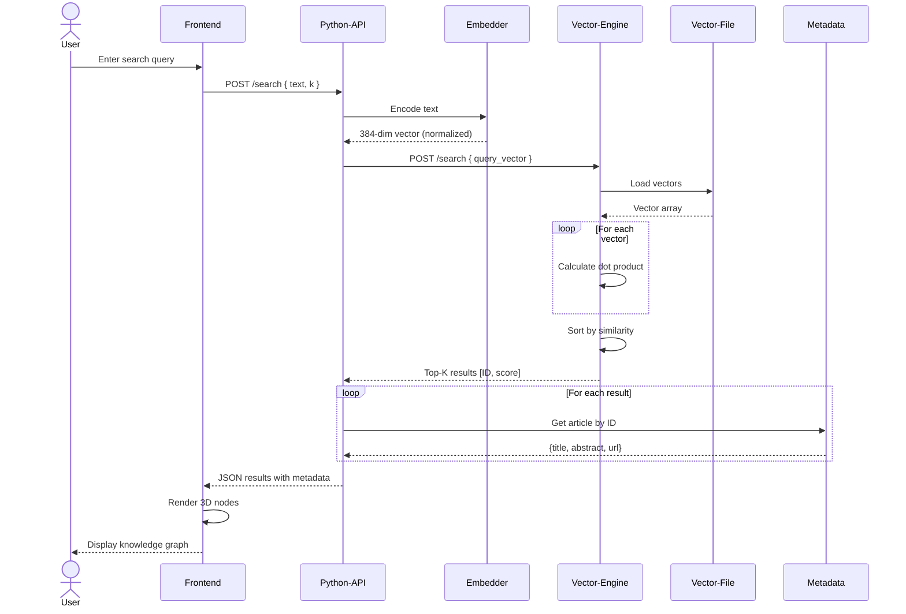

# 🧠 MindMapAI
https://github.com/user-attachments/assets/81557363-25f6-46ec-9361-b6fa669a538f


> **An AI-powered 3D knowledge graph visualization system that transforms Wikipedia data into an immersive, interactive learning experience**

MindMapAI is a full-stack application that combines high-performance vector search, AI research agents, and stunning 3D visualizations to create a unique knowledge exploration platform. Built with a microservices architecture featuring a C++ vector engine, Python AI backend, and Next.js frontend.

<p align="center">
  
  
  
  
  
  

</p>

## Goal
Have you ever been so deep into research where you forget the main question you started with? When building and designing MindMapAI, I thought about
a way to solve this issue. What if all my research wasn't just multiple open tabs on my laptop, but instead a MindMap of related nodes, where I could jump through
topics and visualize their relations all at once, without having to search through tabs.

Solving this problem was the main motivation behind MindMapAI.

## Features 
### **Multi-Agent Research System**
- **Three Research Personas**:
  - 🟢 **Optimist**: Highlights opportunities, benefits, and positive aspects
  - 🔴 **Critic**: Identifies risks, challenges, and potential issues
  - 🟡 **Historian**: Provides historical context and evolutionary perspective

### **High-Performance Vector Search**
- **C++ Vector Engine** performs cosine similarity search using dot product calculations between text query (vectorized and normalized) and wikipedia data (vectorized and normalized)
- **Sentence Transformers** from HuggingFace to create the text embeddings and transform the text query and wikipedia text into dimensional vectors

### **Image Analysis**
- Upload images to extract concepts and generate related knowledge graphs
### **Auto-Pilot Mode**
- Autonomous deep exploration of related topics

## Usage 

### 1. Standard Knowledge Search 
Type any topic into the text search bar and MindMapAI generates a 3D graph of the most semantically related Wikipedia articles, ranked by cosine similarity (dot product calculation).


### 2. Out-of-database Topics (Google Gemini Fallback)
If a query isn't well-represented in the vector database, MindMapAI automatically queries Gemini to surface relevant information and related topic nodes before falling back to vector search — so results stay relevant even for niche or recent topics.


### 3. Multi-Agent Research Mode 
Activate Optimist, Critic, and Historian agents to explore a topic from three perspectives simultaneously. Each agent runs its own Gemini-prompted analysis and surfaces its own top-5 related nodes, letting you see a topic's opportunities, risks, and historical context side-by-side on the graph.
`[Screenshot/GIF: multi-agent graph output]`

### 4. Image-Based Exploration 
Upload an image and MindMapAI extracts key concepts using Gemini, then runs a vector search for each concept to find related articles. Results are deduplicated, ranked, and rendered directly into the graph.
`[Screenshot/GIF: image upload → resulting graph]`

## Architecture Overview 
```text
User → Next.js Frontend → Python API (FastAPI)
                              ├─→ C++ Vector Engine (similarity search)
                              ├─→ Gemini API (research agent personas + fallback)
                              ├─→ HuggingFace - Sentence Transformers (embeddings)
                              └─→ Wikipedia API (data source)
```


## Technology Stack

### **Frontend**
| Technology | Purpose |
|------------|---------|
| **Next.js** | React framework with server-side rendering |
| **React** | UI component library |
| **Three.js** | 3D rendering engine |
| **react-force-graph-3d** | Force-directed 3D graph visualization |
| **three-spritetext** | 3D text labels |
| **TailwindCSS** | Utility-first CSS framework |
| **TypeScript** | Type-safe JavaScript |

### **Backend (Python API)**
| Technology | Purpose |
|------------|---------|
| **FastAPI** | High-performance async web framework |
| **Sentence Transformers** | Text embedding generation |
| **Google Generative AI** | Gemini 3.0 Flash integration |
| **NumPy** | Numerical operations |
| **Wikipedia** | Wikipedia API wrapper |
| **python-dotenv** | Environment variable management |
| **Pydantic** | Data validation |

### **Vector Engine (C++)**
| Technology | Purpose |
|------------|---------|
| **C++17** | High-performance vector operations |
| **cpp-httplib** | HTTP server library |
| **nlohmann/json** | JSON parsing |
| **STL** | Vector and algorithm implementations |

### **Infrastructure**
| Technology | Purpose |
|------------|---------|
| **Docker** | Containerization |
| **Docker Compose** | Multi-container orchestration |


## Sequence Diagram - How it works   



## How to run the app locally

### Prerequisites

- **Docker** & **Docker Compose**
- OR manually install:
  - Python 3.9+
  - Node.js 18+
  - C++ compiler (g++/clang)
  - Make

### Using Docker 

1. **Clone the repository**
   ```bash
   git clone https://github.com/yourusername/MindMapAI.git
   cd MindMapAI
   ```

2. **Set up environment variables**
   ```bash
   cd python-api
   cp .env.example .env
   # Edit .env and add your GEMINI_API_KEY
   nano .env
   ```

3. **Build and run with Docker Compose**
   ```bash
   cd ..
   docker-compose up --build
   ```

4. **Access the application**
   - Frontend: [http://localhost:3000](http://localhost:3000)
   - Python API: [http://localhost:8000](http://localhost:8000)
   - C++ Engine: [http://localhost:8080](http://localhost:8080)

## Challenges Faced 
