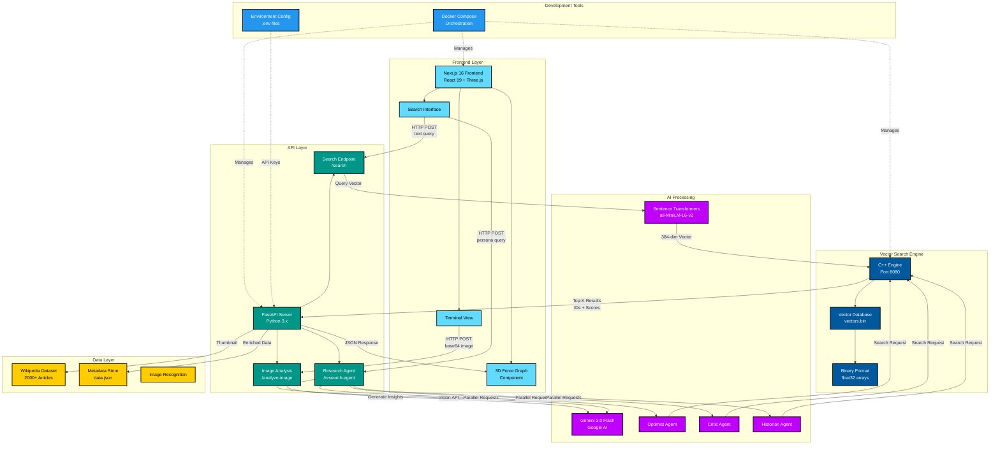
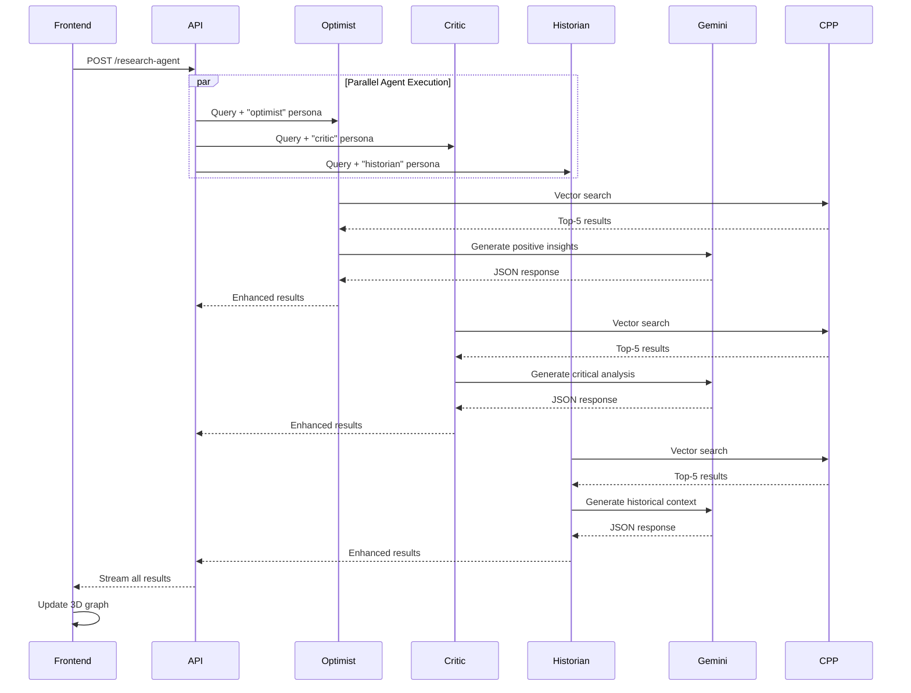

# 🧠 MindMapAI
<video src = "./MindMapAI_Demo.mp4" width = "320" height="240" controls></video>

> **An AI-powered 3D knowledge graph visualization system that transforms Wikipedia data into an immersive, interactive learning experience**

MindMapAI is a cutting-edge full-stack application that combines high-performance vector search, AI research agents, and stunning 3D visualizations to create a unique knowledge exploration platform. Built with a microservices architecture featuring a C++ vector engine, Python AI backend, and Next.js frontend.

<p align="center">
  
  
  
  
  
  
</p>

---

## Table of Contents

- [Features](#-features)
- [Architecture](#-architecture)
- [Technology Stack](#-technology-stack)
- [Project Structure](#-project-structure)
- [Getting Started](#-getting-started)
- [How It Works](#-how-it-works)
- [API Documentation](#-api-documentation)
- [Configuration](#-configuration)
- [Development](#-development)
- [Performance](#-performance)
- [Troubleshooting](#-troubleshooting)
- [Contributing](#-contributing)
- [License](#-license)

---

## Features

### **Immersive 3D Visualization**
- **Interactive Force-Directed Graph**: Navigate through knowledge nodes in 3D space
- **Color-Coded Perspectives**: Visual differentiation of AI agent types (Optimist, Critic, Historian)
- **Real-time Updates**: Watch the graph expand as AI agents discover new connections
- **Smooth Animations**: Glass-morphism UI with polished transitions and effects

### **Multi-Agent AI System**
- **Three Research Personas**:
  - 🟢 **Optimist**: Highlights opportunities, benefits, and positive aspects
  - 🔴 **Critic**: Identifies risks, challenges, and potential issues
  - 🟡 **Historian**: Provides historical context and evolutionary perspective
- **Parallel Processing**: All agents work simultaneously for comprehensive coverage
- **Gemini AI Integration**: Powered by Google's Gemini 2.0 Flash for intelligent analysis

### **High-Performance Vector Search**
- **C++ Vector Engine**: Lightning-fast similarity search using optimized dot product calculations
- **Binary Storage Format**: Efficient storage of 384-dimensional embeddings
- **Low Latency**: Sub-millisecond query response times for 2000+ vectors
- **Sentence Transformers**: Using `all-MiniLM-L6-v2` for semantic embedding generation

### **Advanced Features**
- **Image Analysis**: Upload images to extract concepts and generate related knowledge graphs
- **Wikipedia Integration**: Automatically fetches thumbnails and metadata
- **Terminal View**: Real-time streaming of AI agent thoughts and research progress
- **Auto-Pilot Mode**: Autonomous deep exploration of related topics

---

## Architecture



### Component Communication Flow

1. **User Input Flow**
   - User enters search query in Next.js frontend
   - Frontend sends HTTP POST request to Python API (`/search` or `/research-agent`)

2. **Embedding Generation**
   - Python API uses Sentence Transformers to convert text → 384-dimensional vector
   - Query vector is normalized for cosine similarity search

3. **Vector Search**
   - Python API forwards vector to C++ engine via HTTP
   - C++ engine performs optimized dot product calculations across all stored vectors
   - Returns top-K most similar articles with similarity scores

4. **AI Enrichment (Research Mode)**
   - Three AI agents (Optimist, Critic, Historian) query in parallel
   - Each agent sends search requests and generates unique insights via Gemini AI
   - Results are color-coded and streamed back to frontend

5. **Data Enrichment**
   - Python API hydrates results with metadata from `data.json`
   - Fetches Wikipedia thumbnails via MediaWiki API
   - Returns complete node data with titles, abstracts, URLs, and images

6. **3D Visualization**
   - Frontend receives JSON response with nodes and edges
   - Three.js renders nodes as 3D spheres with physics-based positioning
   - Force-directed graph algorithm arranges nodes spatially
   - Users can interact, rotate, and explore the knowledge graph

---

## Technology Stack

### **Frontend**
| Technology | Version | Purpose |
|------------|---------|---------|
| **Next.js** | 16.1.5 | React framework with server-side rendering |
| **React** | 19.2.3 | UI component library |
| **Three.js** | 0.182.0 | 3D rendering engine |
| **react-force-graph-3d** | 1.29.0 | Force-directed 3D graph visualization |
| **three-spritetext** | 1.10.0 | 3D text labels |
| **TailwindCSS** | 4.x | Utility-first CSS framework |
| **TypeScript** | 5.x | Type-safe JavaScript |

### **Backend (Python API)**
| Technology | Version | Purpose |
|------------|---------|---------|
| **FastAPI** | Latest | High-performance async web framework |
| **Sentence Transformers** | Latest | Text embedding generation |
| **Google Generative AI** | Latest | Gemini 2.0 Flash integration |
| **NumPy** | Latest | Numerical operations |
| **Wikipedia** | Latest | Wikipedia API wrapper |
| **python-dotenv** | Latest | Environment variable management |
| **Pydantic** | Latest | Data validation |

### **Vector Engine (C++)**
| Technology | Purpose |
|------------|---------|
| **C++17** | High-performance vector operations |
| **cpp-httplib** | HTTP server library |
| **nlohmann/json** | JSON parsing |
| **STL** | Vector and algorithm implementations |

### **Infrastructure**
| Technology | Purpose |
|------------|---------|
| **Docker** | Containerization |
| **Docker Compose** | Multi-container orchestration |
| **Linux/Alpine** | Lightweight container images |

---

## 📁 Project Structure

```
MindMapAI/
├── 📂 frontend/                 # Next.js React frontend
│   ├── 📂 app/
│   │   ├── layout.tsx          # Root layout component
│   │   └── page.tsx            # Main home page
│   ├── 📂 components/
│   │   └── Graph.js            # 3D force graph component
│   ├── 📂 public/              # Static assets
│   ├── package.json            # Node dependencies
│   ├── Dockerfile              # Frontend container config
│   └── next.config.ts          # Next.js configuration
│
├── 📂 python-api/               # FastAPI backend
│   ├── api.py                  # Main API server with endpoints
│   ├── create_embeddings.py   # Generate vectors from data.json
│   ├── get_wiki_data.py        # Fetch Wikipedia articles
│   ├── test_server.py          # API testing script
│   ├── data.json               # Wikipedia metadata (2000 articles)
│   ├── .env                    # API keys and configuration
│   └── Dockerfile              # Python API container config
│
├── 📂 cpp-engine/               # C++ vector search engine
│   ├── engine.cpp              # Standalone vector DB test
│   ├── server.cpp              # HTTP server for vector search
│   ├── vectors.bin             # Binary storage of embeddings
│   ├── httplib.h               # Header-only HTTP library
│   ├── json.hpp                # JSON parsing library
│   └── Dockerfile              # C++ engine container config
│
├── docker-compose.yml          # Multi-service orchestration
├── .gitignore                  # Git exclusions
└── README.md                   # This file
```

---

## Getting Started

### Prerequisites

- **Docker** & **Docker Compose** (recommended)
- OR manually install:
  - Python 3.9+
  - Node.js 18+
  - C++ compiler (g++/clang)
  - Make

### Quick Start with Docker (Recommended)

1. **Clone the repository**
   ```bash
   git clone https://github.com/yourusername/MindMapAI.git
   cd MindMapAI
   ```

2. **Set up environment variables**
   ```bash
   cd python-api
   cp .env.example .env
   # Edit .env and add your GEMINI_API_KEY
   nano .env
   ```

3. **Build and run with Docker Compose**
   ```bash
   cd ..
   docker-compose up --build
   ```

4. **Access the application**
   - Frontend: [http://localhost:3000](http://localhost:3000)
   - Python API: [http://localhost:8000](http://localhost:8000)
   - C++ Engine: [http://localhost:8080](http://localhost:8080)

### Manual Setup (Development)

#### 1. Set up Wikipedia Data

```bash
cd python-api
python get_wiki_data.py  # Fetches 2000 Wikipedia articles
```

#### 2. Generate Embeddings

```bash
python create_embeddings.py  # Creates vectors.bin
cp vectors.bin ../cpp-engine/
```

#### 3. Start C++ Engine

```bash
cd ../cpp-engine
g++ -std=c++17 -O3 -o server server.cpp
./server  # Runs on port 8080
```

#### 4. Start Python API

```bash
cd ../python-api
pip install -r requirements.txt
uvicorn api:app --reload  # Runs on port 8000
```

#### 5. Start Frontend

```bash
cd ../frontend
npm install
npm run dev  # Runs on port 3000
```

---

## How It Works

### Data Pipeline

```mermaid
flowchart LR
    A["Wikipedia API"] -->|"Download 2000 articles"| B["get_wiki_data.py"]
    B -->|"Save raw data"| C["data.json"]
    C -->|"Load articles"| D["create_embeddings.py"]
    D -->|"Generate embeddings"| E["Sentence Transformers<br/>all-MiniLM-L6-v2"]
    E -->|"384-dim vectors"| F["Normalize L2"]
    F -->|"Binary format"| G["vectors.bin"]
    G -->|"Load on startup"| H["C++ Engine"]
    C -->|"Load on startup"| I["Python API"]
    
    classDef source fill:#ffcc00,stroke:#000,stroke-width:2px
    classDef process fill:#009688,stroke:#000,stroke-width:2px,color:#fff
    classDef storage fill:#2196F3,stroke:#000,stroke-width:2px,color:#fff
    classDef runtime fill:#f44336,stroke:#000,stroke-width:2px,color:#fff
    
    class A source
    class B,D,E,F process
    class C,G storage
    class H,I runtime
```



### Search Algorithm

The vector search uses **cosine similarity** via normalized dot products:

1. **Query Processing**
   - Text → Embedding: `query_vector = model.encode(query)`
   - Normalization: `query_vector = query_vector / ||query_vector||`

2. **Similarity Calculation**
   ```cpp
   for each vector v in database:
       score = dot_product(query_vector, v)  // Already normalized
       results.push({score, vector_id})
   ```

3. **Ranking**
   - Sort by score (descending)
   - Return top-K results

**Performance**: ~2ms for 2000 vectors on modern CPU

### AI Agent System

Each research agent follows this workflow:



---

## 📡 API Documentation

### Base URL
- **Development**: `http://localhost:8000`
- **Production**: Configure via environment variables

### Endpoints

#### 1. `/search` (POST)
Basic semantic search across Wikipedia articles.

**Request Body:**
```json
{
  "text": "string",        // Search query
  "k": 5                   // Number of results (default: 5)
}
```

**Response:**
```json
[
  {
    "id": "42",
    "title": "Quantum Computing",
    "abstract": "Quantum computing is...",
    "url": "https://en.wikipedia.org/wiki/Quantum_computing",
    "score": 0.92,
    "thumbnail": "https://upload.wikimedia.org/..."
  }
]
```

#### 2. `/research-agent` (POST)
Multi-agent research with AI-generated insights.

**Request Body:**
```json
{
  "text": "string",        // Search query
  "k": 5,                  // Results per agent
  "persona": "optimist"    // "optimist" | "critic" | "historian"
}
```

**Response:**
```json
{
  "nodes": [
    {
      "id": "42",
      "title": "Quantum Computing",
      "abstract": "...",
      "url": "https://...",
      "group": "Optimist",
      "thumbnail": "https://..."
    }
  ],
  "thoughts": [
    "Exploring quantum advantages...",
    "Investigating superposition benefits..."
  ]
}
```

#### 3. `/analyze-image` (POST)
Analyze uploaded images to extract concepts.

**Request Body:**
```json
{
  "image_base64": "data:image/png;base64,iVBORw0KG..."
}
```

**Response:**
```json
[
  {
    "id": "15",
    "title": "Computer Vision",
    "abstract": "...",
    "url": "https://...",
    "group": "Gemini"
  }
]
```

---

## Configuration

### Environment Variables

Create `python-api/.env`:

```bash
# Required
GEMINI_API_KEY=your_gemini_api_key_here

# Optional
DEV_MODE=false                          # Enable mock responses
CPP_SERVER_URL=http://cpp_engine:8080/search  # C++ engine URL (Docker)
```

### Getting a Gemini API Key

1. Visit [Google AI Studio](https://makersuite.google.com/app/apikey)
2. Sign in with your Google account
3. Click "Create API Key"
4. Copy and paste into `.env`

### Docker Ports

| Service | Internal Port | External Port |
|---------|---------------|---------------|
| Frontend | 3000 | 3000 |
| Python API | 8000 | 8000 |
| C++ Engine | 8080 | 8080 |

---

## Development

### Running Tests

**Python API:**
```bash
cd python-api
python test_server.py
```

**C++ Engine:**
```bash
cd cpp-engine
g++ -std=c++17 -O3 -o engine engine.cpp
./engine  # Runs test search
```

### Hot Reload

- **Frontend**: Automatic (Next.js dev server)
- **Python**: Use `uvicorn api:app --reload`
- **C++**: Manual recompilation required

### Adding More Wikipedia Articles

Edit `get_wiki_data.py`:
```python
MAX_ARTICLES = 5000  # Increase this number
```

Then regenerate:
```bash
python get_wiki_data.py
python create_embeddings.py
cp vectors.bin ../cpp-engine/
```

### Customizing AI Agents

Edit the persona prompts in `api.py`:
```python
persona_prompts = {
    "optimist": "Focus on opportunities and benefits...",
    "critic": "Identify potential risks and challenges...",
    "historian": "Provide historical context...",
    "your_custom_persona": "Your custom instructions here..."
}
```

---

## Performance

### Benchmarks

| Component | Metric | Value |
|-----------|--------|-------|
| **C++ Engine** | Search latency | ~2ms (2000 vectors) |
| **Python API** | Request time | ~150ms (without AI) |
| **Gemini AI** | Response time | ~800ms (per agent) |
| **Frontend** | Initial load | ~1.2s |
| **Total** | End-to-end | ~2.5s (3 agents parallel) |

### Memory Usage

| Component | Memory |
|-----------|--------|
| C++ Engine | ~15 MB (vectors + code) |
| Python API | ~250 MB (model + dependencies) |
| Frontend | ~80 MB (runtime) |

### Optimization Tips

1. **Increase vector batch size**: Edit `create_embeddings.py` batch processing
2. **Use GPU for embeddings**: Install `sentence-transformers[gpu]`
3. **Cache search results**: Implement Redis caching in `api.py`
4. **CDN for frontend**: Deploy static assets to Vercel/Cloudflare
5. **Horizontal scaling**: Run multiple Python API instances behind load balancer

---

## Troubleshooting

### Common Issues

#### 1. **CORS Errors**
**Symptom**: Frontend can't connect to API  
**Solution**: Check `CORSMiddleware` in `api.py` allows your origin:
```python
app.add_middleware(
    CORSMiddleware,
    allow_origins=["http://localhost:3000"],  # Update if needed
    ...
)
```

#### 2. **Gemini API Quota Exceeded**
**Symptom**: 429 error from Gemini  
**Solution**: Enable DEV_MODE in `.env` for mock responses:
```bash
DEV_MODE=true
```

#### 3. **Vector Engine Not Responding**
**Symptom**: API returns "Connection refused" for C++ engine  
**Solution**: Check engine is running and accessible:
```bash
curl http://localhost:8080/search  # Should return error (needs POST)
```

#### 4. **Missing vectors.bin**
**Symptom**: C++ engine fails to start  
**Solution**: Generate embeddings:
```bash
cd python-api
python create_embeddings.py
cp vectors.bin ../cpp-engine/
```

#### 5. **Frontend Shows Empty Graph**
**Symptom**: 3D view renders but no nodes appear  
**Solution**: Open browser console, check API responses. Verify backend is running.

<!-- ---

## Contributing

We welcome contributions! Here's how you can help:

### Areas for Improvement

- [ ] Add more AI agent personas (e.g., Scientist, Journalist)
- [ ] Implement graph export (PNG, SVG, JSON)
- [ ] Add user authentication and saved graphs
- [ ] Create mobile-responsive UI
- [ ] Add graph filtering and search
- [ ] Implement auto-layout algorithms
- [ ] Add dark/light theme toggle
- [ ] Create tutorial/onboarding flow
- [ ] Add unit and integration tests
- [ ] Implement real-time collaboration -->

### Pull Request Process

1. Fork the repository
2. Create a feature branch (`git checkout -b feature/AmazingFeature`)
3. Make your changes
4. Commit with clear messages (`git commit -m 'Add: Amazing new feature'`)
5. Push to your fork (`git push origin feature/AmazingFeature`)
6. Open a Pull Request
<!-- 
### Code Style

- **Python**: Follow PEP 8
- **TypeScript/JavaScript**: Use Prettier
- **C++**: Follow Google C++ Style Guide

--- -->

## License

This project is licensed under the **MIT License** - see below for details:

```
MIT License

Copyright (c) 2026 MindMapAI Contributors

Permission is hereby granted, free of charge, to any person obtaining a copy
of this software and associated documentation files (the "Software"), to deal
in the Software without restriction, including without limitation the rights
to use, copy, modify, merge, publish, distribute, sublicense, and/or sell
copies of the Software, and to permit persons to whom the Software is
furnished to do so, subject to the following conditions:

The above copyright notice and this permission notice shall be included in all
copies or substantial portions of the Software.

THE SOFTWARE IS PROVIDED "AS IS", WITHOUT WARRANTY OF ANY KIND, EXPRESS OR
IMPLIED, INCLUDING BUT NOT LIMITED TO THE WARRANTIES OF MERCHANTABILITY,
FITNESS FOR A PARTICULAR PURPOSE AND NONINFRINGEMENT. IN NO EVENT SHALL THE
AUTHORS OR COPYRIGHT HOLDERS BE LIABLE FOR ANY CLAIM, DAMAGES OR OTHER
LIABILITY, WHETHER IN AN ACTION OF CONTRACT, TORT OR OTHERWISE, ARISING FROM,
OUT OF OR IN CONNECTION WITH THE SOFTWARE OR THE USE OR OTHER DEALINGS IN THE
SOFTWARE.
```

---

## Acknowledgments

- **Wikipedia** for the amazing open knowledge base
- **Hugging Face** for Sentence Transformers
- **Google** for Gemini AI API
- **React Force Graph** by vasturiano
- **Three.js** community
- **FastAPI** by tiangolo

---

## Contact & Support

- **Issues**: [GitHub Issues](https://github.com/ashram15/MindMapAI/issues)
- **Discussions**: [GitHub Discussions](https://github.com/ashram15/MindMapAI/discussions)
- **Email**: ashram1015@gmail.com


# Railway deployment
